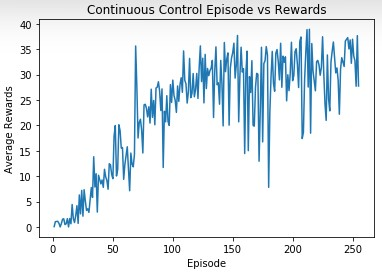

# DDPG - Continuous Control

### Introduction

To train a reinforcement learning agent to maintain a double-jointed arm pointing towards a target. This environment is simulated using Unity's Reacher Environment

### Project Details

1. Observation Space:
    - 33 variables corresponding to position, rotation, velocity, and angular velocities of the arm.
2. Action Space:
    - 4 variables corrensponding to torque applicable to two joints. Range between -1 to 1.
3. Rewarding Strategy:
    - if agent pointed its arm into a goal area, agent received +0.1
    - otherwise +0
4. Solution Requirement:
    - score a minimum of 30 over a average 100 consecuitive episodes

### Implementation

1. Algorithm Approach: DDPG
> This project is solved using Deep Deterministic Policy Gradient (DDPG) approach.
 - DDPG supports output of continuous action space
 - DDPG consists of two models: Actor and Critic.
 - Actor is a policy network that input states and output exact action value.
 - Critic is a Q-value network that output Q-value of the input of state action pair.

2. Hyper-Parameters:
> All parameters can be found in config.py. Most parameters refer to Official Published Paper: Continuous Control with Deep Reinforcement Learning
 - BATCH_SIZE: 128 #minibatch size of inputs 
 - BUFFER_SIZE: 100000 #maximum buffer for replay buffer
 - GAMMA = 0.99 #discouunt rate for network
 - TAU = 0.001 #soft update of target network
 - LR = 0.0001 #learning rate of actor & critic network

### Results

This project is solved in 300 episodes exceeding average rewards of 30. Below shows the results of training process over the time.

### Futuee Work

1. Try other model such as TRPO to compare the results between each other.
2. To make this repo into a general solution for any environment.
